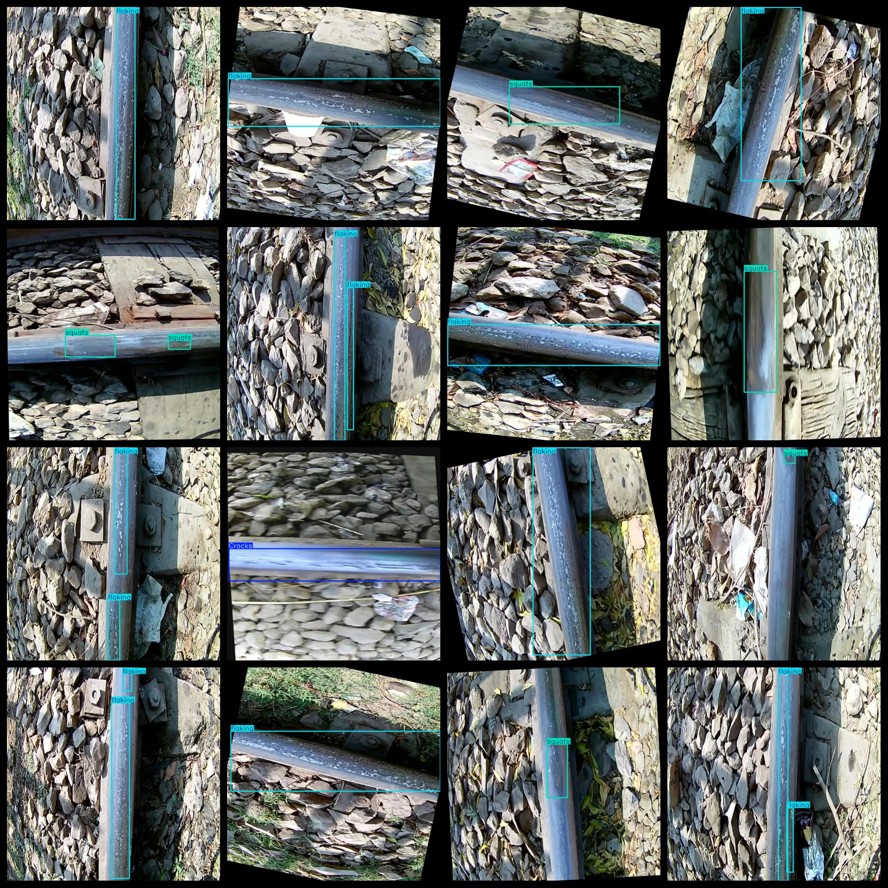

# Rail Defect Detection Dataset 3934 images VOC+YOLO format

The rail defect detection dataset consists of 3934 images in VOC format and YOLO format.

The dataset format includes VOC format and YOLO format.

The compression package contains three folders, each storing images, XML files, and TXT files.

In the JPEGImages folder, there are a total of 3934 jpg images.

In the Annotations folder, there are a total of 3934 XML files.

In the labels folder, there are a total of 3934 TXT files.

There are a total of 4 label types: ["Cracks", "flaking", "joints", "squats"].

These labels are: [“Crack”，“Rupture”，“Joint”，“Abrasion”].

For each label, there are frame counts (please note that the order of categories in YOLO format does not correspond with this count and should be based on the classes.txt file in the labels folder).

- Cracked frames count = 374
- Flaking frames count = 3636
- Joints frames count = 106
- Squats frames count = 1872
- Total frames count = 5988

The image clarity (resolution: pixels) is clear.

The images have been enhanced.

The shape of the labels is rectangular boxes, used for target detection recognition.

Important Notes: No guarantees are made regarding the accuracy or weights of the trained models. The dataset only provides accurate and reasonable annotations.

Annotation and Image Details:
## Images

---

Here is a pay link on Stripe (https://buy.stripe.com/3cs8yP7sY87d0vu9AB). Please contact me lonlonago@foxmail.com after funding $89, and I will send you a complete data files, thank you!

